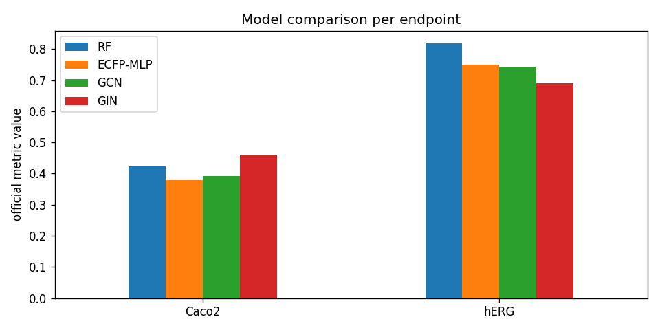

# 🧪 ADMET-Property-Predictor

[](https://colab.research.google.com/github/zqvo04/admet-property-predictor)


**대표 ADMET 엔드포인트를 "회귀 + 이진분류 혼합 멀티태스크"로 예측하는 종합 스위트.**
RandomForest 베이스라인 / ECFP-MLP / GraphConv(GCN·GIN)을 표준 벤치마크
**TDC(Therapeutics Data Commons)** 의 공식 split·지표로 비교하고 리더보드와 나란히 둔다.

> A multitask suite predicting key **ADMET** endpoints as a mix of **regression + binary
> classification**, comparing a RandomForest baseline / ECFP-MLP / GNN (GCN·GIN) on the
> **TDC ADMET benchmark group** with official scaffold splits & metrics.

---

## 💊 ADMET이 왜 중요한가 / Why ADMET

신약 후보의 **80% 이상이 효능이 아니라 ADMET 문제로 임상에서 탈락**한다.
ADMET = **A**bsorption(흡수) · **D**istribution(분포) · **M**etabolism(대사) ·
**E**xcretion(배설) · **T**oxicity(독성). 화합물이 체내에서 "어떻게 흡수·이동·분해·배출되고
독성이 없는가"를 초기에 예측하면 값비싼 후기 실패를 줄일 수 있어, 제약사가 가장 선호하는
ML 적용 분야다. 이 레포는 그 핵심 엔드포인트들을 하나의 프레임워크로 통합한다.

---

## 🎯 이 프로젝트가 증명하는 것 / What this proves

1. **회귀(regression) 모델링** — Tox21(분류)에서 한 단계 확장 (z-score 정규화 + 원단위 역변환).
2. **여러 ADMET 엔드포인트를 하나의 멀티태스크 프레임워크로 통합** — task-type 메타데이터로
   회귀/분류 손실·지표 자동 분기, 결측 라벨 마스킹.
3. **실무에서 가장 많이 쓰이는 ADMET 예측** — 흡수·분포·대사·배설·독성 전 영역 커버.
4. **표준 벤치마크(TDC) 공식 지표로 재현 가능** — scaffold split + 리더보드 직접 비교.

---

## 🗂️ 대상 엔드포인트 / Endpoints

| Endpoint | Type | ADMET | TDC name | Official metric |
|---|---|---|---|---|
| Caco2 | reg | Absorption | `Caco2_Wang` | MAE |
| Solubility | reg | Absorption | `Solubility_AqSolDB` | MAE |
| Lipophilicity | reg | Absorption | `Lipophilicity_AstraZeneca` | MAE |
| PPBR | reg | Distribution | `PPBR_AZ` | MAE |
| VDss | reg | Distribution | `VDss_Lombardo` | Spearman |
| Half_Life | reg | Excretion | `Half_Life_Obach` | Spearman |
| Clearance_Hepatocyte | reg | Excretion | `Clearance_Hepatocyte_AZ` | Spearman |
| LD50 | reg | Toxicity | `LD50_Zhu` | MAE |
| BBBP | cls | Distribution | `BBB_Martins` | ROC-AUC |
| Bioavailability | cls | Absorption | `Bioavailability_Ma` | ROC-AUC |
| CYP2D6_Inhibition | cls | Metabolism | `CYP2D6_Veith` | PR-AUC |
| CYP3A4_Inhibition | cls | Metabolism | `CYP3A4_Veith` | PR-AUC |
| hERG | cls | Toxicity | `hERG` | ROC-AUC |

데이터 출처: **TDC(PyTDC)** 주 데이터 + **MoleculeNet**(ESOL/Lipophilicity/BBBP) 교차검증.
값이 다를 수 있어 출처(`source=tdc|moleculenet`)를 명확히 라벨링한다.

---

## 📊 성능 (placeholder · Colab 실행 후 갱신)

> 아래는 자리표시자입니다. `04_Comparison_Leaderboard.ipynb`를 Colab에서 5-seed로
> 실행한 뒤 실제 값으로 교체하세요. (값↑ 좋음: ROC/PR/Spearman, 값↓ 좋음: MAE)

| Endpoint | metric | RF | ECFP-MLP | GCN | GIN | **TDC best** |
|---|---|---|---|---|---|---|
| Caco2 | MAE ↓ | _ | _ | _ | _ | ~0.276 (MapLight) |
| hERG | ROC-AUC ↑ | _ | _ | _ | _ | ~0.880 |
| Solubility | MAE ↓ | _ | _ | _ | _ | ~0.761 |
| Lipophilicity | MAE ↓ | _ | _ | _ | _ | ~0.467 |
| BBBP | ROC-AUC ↑ | _ | _ | _ | _ | ~0.916 |



리더보드 대비 위치(차이/순위 추정)는 노트북 04의 `cmp_df` 테이블에서 자동 생성된다.

---

## 🔗 신약 발굴 ML 시리즈 / Drug-discovery pipeline series

전체 그림: **독성예측 → ADMET → 분자생성 → 결합예측**을 일관된 모듈 구조로 단계 구축.

| # | Repo | 내용 | 상태 |
|---|---|---|---|
| 1/4 | **Tox21 Toxicity Classifier** | 멀티레이블 독성 분류 (ECFP vs GraphConv), 마스킹 손실, 공통 Trainer | ✅ ([repo](https://github.com/zqvo04/tox21-toxicity-classifier)) |
| 2/4 | **ADMET-Property-Predictor (본 레포)** | 회귀+분류 혼합 멀티태스크, TDC 표준 split·공식 지표·리더보드 비교 | ✅ |
| 3/4 | 분자 생성 (Molecule Generation) | 우수 ADMET 프로파일 분자 생성 (VAE/Flow/Diffusion) | 🔜 |
| 4/4 | 결합 예측 (Binding Affinity) | 단백질-리간드 결합/도킹 스코어 예측 | 🔜 |

> 동일한 `data / featurizers / models / losses / train / evaluate` 모듈 구조와 공통
> Trainer를 재사용해 한 시리즈로 읽히게 유지한다. (Tox21 → ADMET에서 분류 Trainer를
> 회귀/분류 공용으로 확장)

---

## 📁 레포 구조 / Structure

```
admet-property-predictor/
├── notebooks/
│   ├── 01_EDA.ipynb                 # 분포·불균형·TDC vs MoleculeNet·물성 상관·대표 분자
│   ├── 02_ECFP_Baselines.ipynb      # RandomForest + ECFP-MLP (회귀·분류)
│   ├── 03_GraphConv_GIN.ipynb       # GCN vs GIN 멀티태스크
│   └── 04_Comparison_Leaderboard.ipynb  # 전 모델×엔드포인트 + TDC 리더보드 비교
├── src/
│   ├── data.py          # TDC+MoleculeNet 로딩, 엔드포인트 레지스트리, split, z-score 스케일링
│   ├── featurizers.py   # RDKit ECFP(Morgan r=2, 2048bit) + atom-graph→PyG
│   ├── models.py        # ECFPNet(MLP) / GNNNet(GCN·GIN) 공유trunk+멀티헤드
│   ├── losses.py        # masked MSE(회귀)+masked BCE(분류) 혼합 멀티태스크
│   ├── train.py         # 공통 Trainer (ECFP/PyG 어댑터, early stop, ckpt, 학습곡선)
│   └── evaluate.py      # 회귀(RMSE,MAE,Pearson,Spearman)+분류(ROC,PR,F1)+TDC 공식지표
├── docs/PHASE0_research.md   # 참고 레포·TDC 사용법·리더보드 제출 가이드
├── results/figures/
├── requirements.txt
├── setup_colab.sh           # 자가치유형 Colab 설치 (torch 2.x / py3.11~3.12)
└── README.md
```

---

## ▶️ 실행법 / How to run (Google Colab · T4)

```python
# 1) 클론 + 셋업 (자가치유: 이미 있으면 pull)
!git clone https://github.com/zqvo04/admet-property-predictor.git || \
    (cd admet-property-predictor && git pull)
%cd admet-property-predictor
!bash setup_colab.sh

# 2) 노트북 순서대로 실행
#    01_EDA → 02_ECFP_Baselines → 03_GraphConv_GIN → 04_Comparison_Leaderboard
#    실전 학습: 환경변수로 epoch/endpoint 확장
import os; os.environ["ADMET_EPOCHS"] = "100"
```

로컬:
```bash
pip install -r requirements.txt
# 노트북의 CONFIG 셀에서 REG_EP / CLS_EP / EPOCHS 조정
```

---

## 🏆 TDC 리더보드 제출 / Leaderboard submission

1. 엔드포인트별 seed `[1,2,3,4,5]` 5회 학습 (valid로 early stopping, **고정 test로 예측**).
2. `group.evaluate_many(predictions_list)` → `{name: [mean, std]}` 공식 점수.
3. 재현 코드 링크(본 repo) + 방법(featurizer/model/하이퍼파라미터) 첨부해
   [TDC ADMET 리더보드](https://tdcommons.ai/benchmark/admet_group/)에 제출.
4. **주의**: test 라벨로 튜닝 금지 — valid로만 모델 선택. (상세: `docs/PHASE0_research.md`)

---

## 🛠️ 기술 스택 / Stack

PyTDC · RDKit · PyTorch · PyTorch Geometric · scikit-learn · Matplotlib/Seaborn

설계 원칙: 데이터는 TDC/MoleculeNet에서 받되 **특징화는 RDKit로 직접**(numpy 호환성 회피),
회귀/분류 통합 task-type 메타데이터, 회귀 타깃 z-score 정규화(역변환 평가),
TDC 공식 지표로 리더보드와 동일 기준 출력.

---

## 📄 License

MIT
